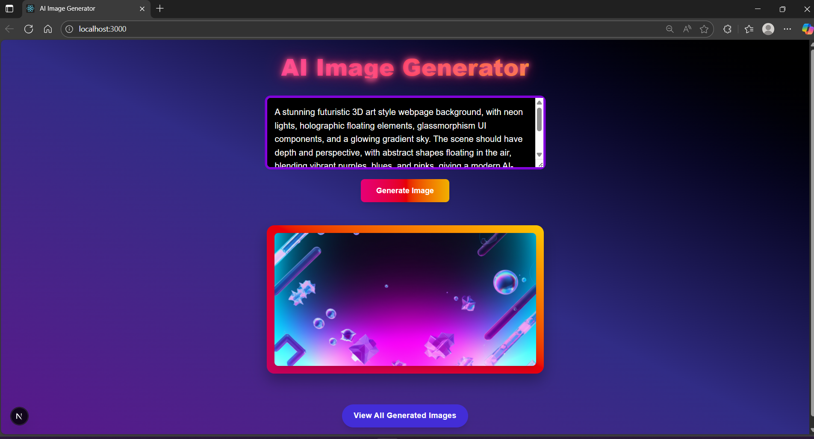
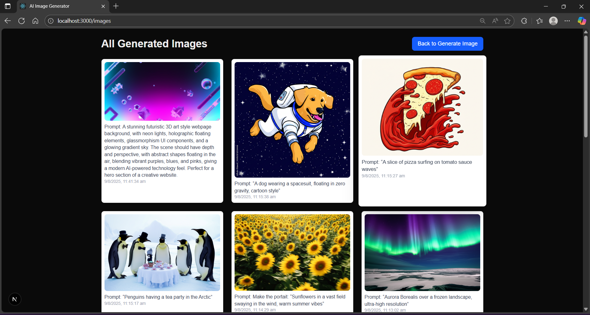

# AI Image Generator (Next.js + TypeScript + Tailwind CSS)

A full-stack AI-powered image generator built with **Next.js App Router**, **TypeScript**, **Tailwind CSS**, and **Google Gemini AI**.  
Users can **enter a text prompt**, generate an image using `gemini-2.0-flash-preview-image-generation`, save it to the database, and view all generated images on a separate gallery page.

---

## Features

- **Prompt-based AI image generation** using Google Gemini API
- **Image storage** in a database (PostgreSQL / MongoDB)
- **Gallery page** to view all generated images
- **Responsive design** using Tailwind CSS
- **Next.js App Router** for fast, modern routing
- **Environment variable support** for API keys

---

## 🌐 Live URLs

| Page                   | Description                                 | URL           |
|------------------------|---------------------------------------------|---------------|
| **Home Page**          | Enter a text prompt and generate an AI image| `/`           |
| **Gallery Page**       | View all generated images from the database | `/images`    |
| **API - Generate Image** | POST endpoint to generate an image from prompt | `/api/generate` |
| **API - Get All Images** | GET endpoint to fetch stored images        | `/api/images` |

---

## Website Preview





---

## Tech Stack

- **Frontend:** [Next.js](https://nextjs.org/) (App Router) + [Tailwind CSS](https://tailwindcss.com/)
- **Backend:** API Routes in Next.js
- **Database:** PostgreSQL / MongoDB
- **AI API:** [Google Gemini](https://ai.google.dev/)
- **Language:** TypeScript

---

## ⚙️ Installation

### 1️⃣ Clone the Repository

```bash
git clone https://github.com/your-username/ai-image-generator.git
cd ai-image-generator
```

### 2️⃣ Install Dependencies

```bash
npm install
# or
yarn install
```

### 3️⃣ Set Up Environment Variables

Create a `.env.local` file in the root directory and add your configuration:

```env
GOOGLE_GEMINI_API_KEY=your_gemini_api_key
DATABASE_URL=your_database_url
```

### 4️⃣ Run the Development Server

```bash
npm run dev
# or
yarn dev
```

Open [http://localhost:3000](http://localhost:3000) in your browser to see the app.

---

## Usage

1. **Generate Image:**  
   Enter a text prompt on the homepage and click "Generate". The AI will create an image based on your prompt.

2. **View Gallery:**  
   Visit the `/images` page to see all images generated by users.

---

## API Endpoints

- **POST `/api/generate`**  
  Generate an image from a prompt.

- **GET `/api/images`**  
  Fetch all stored images.

---

## Acknowledgements

- [Next.js](https://nextjs.org/)
- [Tailwind CSS](https://tailwindcss.com/)
- [Google Gemini](https://ai.google.dev/)

---

